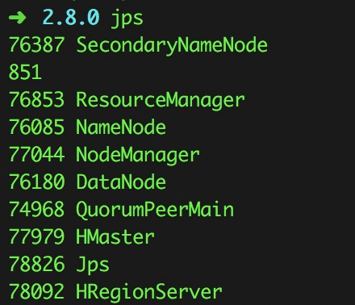
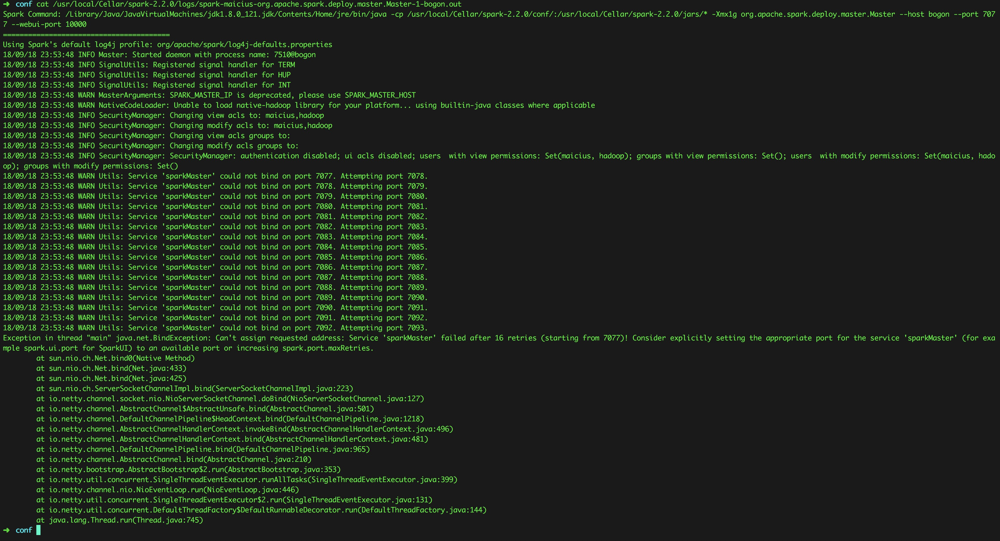

# WifiProbeAnalysis 系统安装配置说明

本说明指在本地环境（MacOS）上进行安装测试，以方便进行二次开发。由于本项目实际开发周期比较短，存在较多bug，且我们几人都没有继续开发的兴趣，所以仅供学习交流之用。

由于时间过得较久，记忆可能出现偏差，这次测试只保证各个项目能正常启动运行，功能方面未详细测试，若有错误，恳请谅解

[restart_all](./py-script/restartHbase.py)脚本中有常用的一些指令，可以参考

### 计算中心Computing-core项目配置：

- 1.请确认Java、Scala、Hadoop、Spark环境已经配置，以下是我们开发时使用的版本：
	
	* JDK: 1.8
	* Hadoop: 2.7.4
	* HBase: 1.3.0
	* Spark: 2.2.0
	* Scala: 2.11.11
	* redis-server: 4.0.0

- 2.由于时间较久，很多配置教程我都找不到了，关于Hadoop的配置，可以参考这篇博客[Setting up Hadoop 2.6 on Mac OS X Yosemite
](http://zhongyaonan.com/hadoop-tutorial/setting-up-hadoop-2-6-on-mac-osx-yosemite.html)

- 3.启动Spark和Hadoop之后，使用jps命令来查看已经启动的程序，必须确保有以下几个程序：
   
	注意，以上程序一个都不能少，少一个就会出问题。

- 4.修改my.properties配置文件，在本地模式下，只需要确保spark.local=true，spark.local.check.point.dir和spark.local.data.source使用的是默认配置，可以根据自己的配置进行修改。如果使用了分布式模式，spark.local=false，并修改相应的data.source和check.point配置。

- 5.修改db.properties配置文件，包括redis和mysql的配置

- 6.在IDEA中启动 scala.edu.cs.scu.analysis.Main，没有任何错误则正常启动,如有错误请参考下一节

### Computing-core项目配置常见错误

以下是我时隔一年之后重新配置这个项目时遇见的一些错误

- 启动Spark Master失败，但是Worker成功，启动Master时日志如下：
	

原因是第一个WARN,Spark已经不建议使用SPARK\_MASTER\_IP来指定master的ip，而是使用SPARK\_MASTER\_HOST
	  
	于是在配置文件中改掉就好
	

- 启动程序报redis连接错误  
确保redis-server已经启动，在配置文件中正确配置redis.url和redis.password，如果redis没有设置密码，redis.password设置为空
	

- Hbase 已启动，但是使用list指令出现错误：Can't get master address from ZooKeeper; znode data == null

原因可能有很多：

* 1.hbase 和zookeeper在单机部署上，zookeeper和hbase的服务通常不稳定，重启即可解决。这里我写了一个脚本来重启[restart_hbase]()，注意启动时要先启动zookeeper再启动hbase。
* 2.新旧版本数据不一致，参考这篇博客[can't get master address from zookeeper /新旧数据不一致](https://my.oschina.net/u/2377453/blog/466374)

* 3.如果以上方法都不行，则使用下面这个终极方法,重新格式化namenode(若有重要数据请自行备份)。

	> cd {hadoop directory}  
	
	删除data文件夹，这个文件夹为自己配置文件中dfs.name.dir的路径，如果不删除会导致datanode与namenode的clusterID不一致，进而导致datanode启动失败。详情参考这篇博客[解决Hadoop启动时，没有启动datanode](https://blog.csdn.net/islotus/article/details/78357857)
	
	> rm -rf {data directory}
	
	格式化namenode
	
	> bin/hdfs namenode -format
	
	> sbin/start-dfs.sh
	
	> bin/hdfs dfs -mkdir /user
	
    >bin/hdfs dfs -mkdir /user/{username} #make sure you add correct username here
	
	启动 zookeeper  
	> zkServer start  
	
	进入zkCli  
	
	> zkCli  
	
	删除/hbase数据，防止2中提到的问题  
	
	> rmr /hbase
	
	启动hbase  
	> ./start-hbase.sh

* 4.如果遇见任何关于Scala兼容性的问题，请确保使用的Scala版本与本文中一致，即2.11.11

### 前端web-ui配置

[web-ui配置说明](./web-ui/README.md)

这个比较简单，如果不能正常运行，通常是前端依赖包版本不同导致的，请注意npm install时候的各种警告  
2018年9月19日，配置运行成功

### 网站后端web-server 配置

[web-server项目配置](./web-server/README.md)  
这是一个普通的Java-web项目，依赖都写在maven里，按自己需求修改db.properties后基本上就能跑起来  
用户数据是保存在redis中的，所以不需要进行什么建表操作(其实我觉得这里应该使用mysql来保存永久性数据，但是项目开发时为了应用新知识，就全部改为了redis)

[redis说明.md](./web-server/redis说明.md)
这是redis中使用的数据结构说明文档，但只需要保证redis正常启动就行

需要注意的是，由于本项目并没有在前端提供注册的方式，因为这个可以通过管理员来添加。所以可以通过下面这个链接直接访问后端的注册接口进行注册：

> http://localhost:8080/userRegist.action?userName={username}&password={password}&nickName={nickname}

### kafka-core项目配置

修改db.properties、hbase.properties为自己的配置，启动运行是没啥问题，这个项目写得比较混乱，当时改的方案比较多，做缓存一会儿用redis，一会儿用hbase，我也记不大清了。

### 模拟发包脚本
请根据需要修改  
[模拟发包脚本](./py-script/URLTest.py)